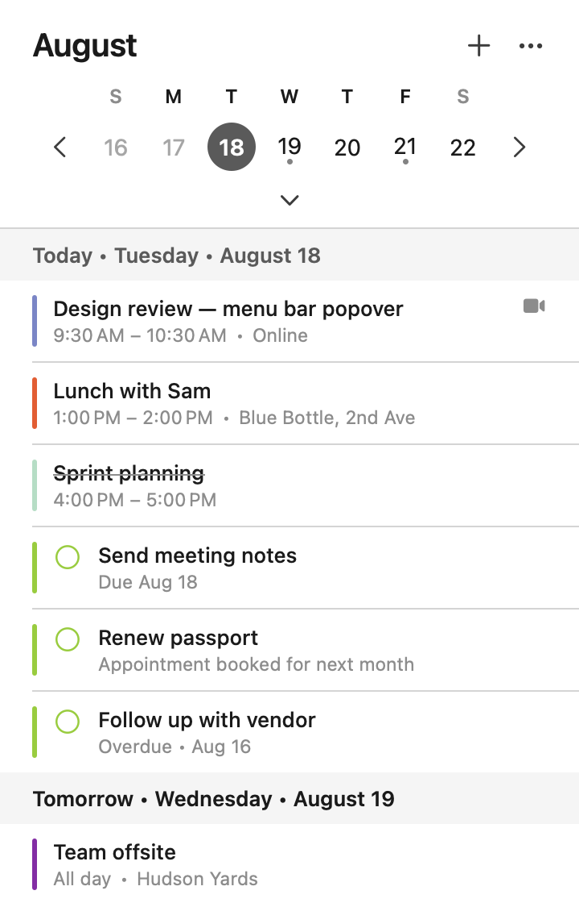
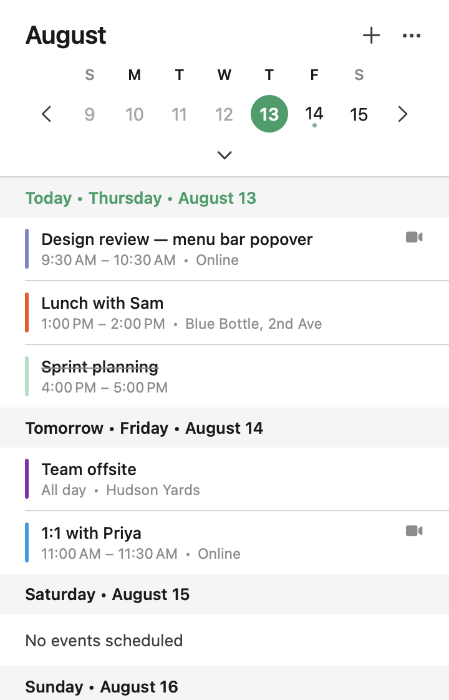
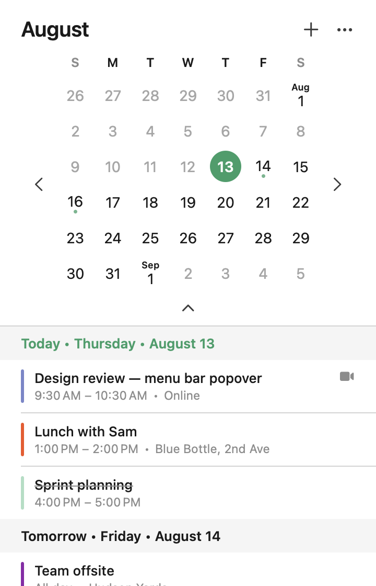
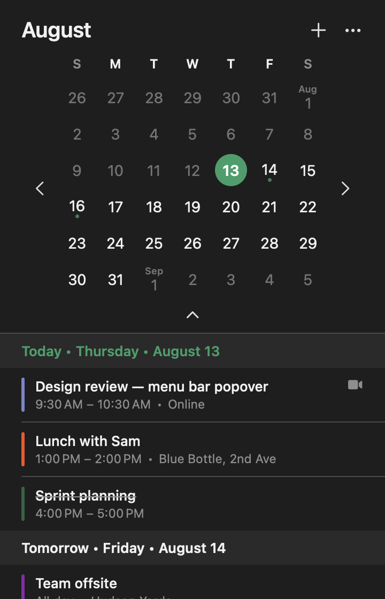
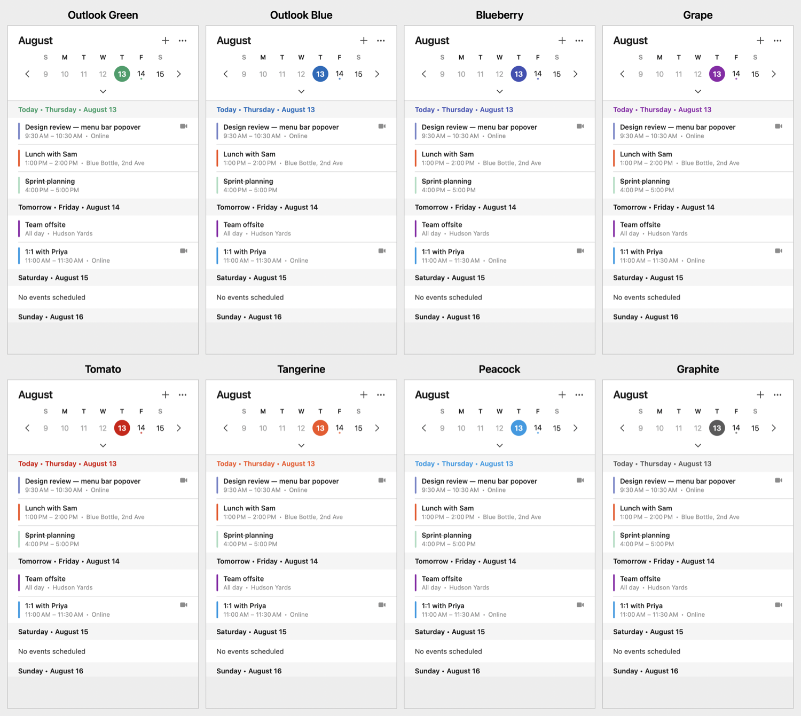

# Calendar Bar

A native macOS menu bar app that shows your Google Calendar agenda — and Google Tasks — in a
popover styled after Microsoft Outlook's menu bar calendar. Data is fetched straight from
Google's REST APIs over OAuth 2.0 + PKCE — no EventKit, no Apple Calendar involvement — so
per-event custom colors are preserved exactly as you set them in Google Calendar.



- Agent app (`LSUIElement`): menu bar only, no Dock icon, no app menu
- Collapsible month/week grid, accent-colored "today" badge, week/month navigation arrows
- Seven-day agenda, grouped by day: `Today • Thursday • August 13`, `Tomorrow`, …
- Google Tasks shown inside their due day, with a checkbox to mark complete inline
- Per-event colors matched to Google Calendar's palette, including the newer extended
  swatches and birthday events (see [Colors](#colors))
- Nine switchable accent palettes plus light/dark override, from the **…** menu
- Tokens stored in the macOS Keychain; refreshes on popover open and every 10 minutes
- Universal binary (Apple Silicon + Intel), macOS 13 Ventura or newer

| | | |
|---|---|---|
|  |  |  |

## Setup

### 1. Google Cloud project

1. [console.cloud.google.com](https://console.cloud.google.com) → create/select a project.
2. **APIs & Services → Library** → enable **Google Calendar API** and **Google Tasks API**.
3. **APIs & Services → OAuth consent screen**:
   - User type **External** (or Internal on Workspace); fill in app name and support email.
   - Scopes: `openid`, `email`, `.../auth/calendar.readonly`, `.../auth/tasks`.
   - While the app is in *Testing*, add your own Google account under **Test users**.
4. **APIs & Services → Credentials → Create credentials → OAuth client ID**:
   - Application type **Desktop app**. No redirect URI setup needed — the app uses a
     loopback redirect (`http://127.0.0.1:<random-port>`), which Google allows automatically.
5. Copy the **Client ID** and **Client secret**.

### 2. Credentials

Pick whichever you prefer — checked in this order:

| Order | Location | Notes |
| --- | --- | --- |
| 1 | `GOOGLE_CLIENT_ID` / `GOOGLE_CLIENT_SECRET` env vars | Handy for `swift run` |
| 2 | `~/.config/calendarbar/.env` | Keeps secrets out of the repo |
| 3 | `.env` in this folder | Copied into the app bundle by `build-app.sh` |
| 4 | Constants in [`Config/AppConfig.swift`](Sources/CalendarBar/Config/AppConfig.swift) | Replace `YOUR_CLIENT_ID` / `YOUR_CLIENT_SECRET` |

`.env` format (see [`.env.example`](.env.example)):

```
GOOGLE_CLIENT_ID=your-client-id.apps.googleusercontent.com
GOOGLE_CLIENT_SECRET=your-client-secret
```

Key names are matched loosely — `GOOGLE_CLIENT_ID`, `CLIENT_ID`, `Client ID`, `client-id`
all work.

> Google's Desktop-app token endpoint normally requires `client_secret` even with PKCE. If
> it's missing, the app still attempts a PKCE-only exchange and says exactly what to add if
> Google rejects it.

### 3. Running it

Requires the Swift toolchain (Command Line Tools are enough — `xcode-select --install`;
full Xcode is optional).

```bash
swift run
```

The status item appears in the menu bar; click it, then **Sign in with Google**.

Or open `Package.swift` in Xcode and press ⌘R. Xcode runs the bare executable, which still
hides the Dock icon (the app sets `.accessory` activation at launch). Use `./build-app.sh`
for a proper `.app`.

### 4. Building the .app / DMG

```bash
./build-app.sh            # build only, into dist/
./build-app.sh --install  # build, move to /Applications, leave no duplicate
./build-app.sh --run      # build and launch
./package-dmg.sh          # produce dist/CalendarBar-1.0.dmg
```

`build-app.sh` builds a Universal binary (verify with `lipo -archs "dist/Calendar
Bar.app/Contents/MacOS/CalendarBar"` → `x86_64 arm64`), embeds `Info.plist`
(`LSUIElement`, `LSMinimumSystemVersion`), copies `.env` into the bundle, and ad-hoc signs
it. `--install` removes the build copy afterward — without that, two bundles sharing a name
both register with LaunchServices and the app shows up twice in Launchpad/Spotlight.
`package-dmg.sh` prints the `codesign`/`notarytool` commands needed to distribute outside
your own Mac.

### 5. Starting at login

The app is a normal background agent — no terminal or script needs to stay open. Either
tick it under **System Settings → General → Login Items → +**, or install the included
LaunchAgent:

```bash
cp com.calendarbar.app.plist ~/Library/LaunchAgents/
launchctl bootstrap gui/$(id -u) ~/Library/LaunchAgents/com.calendarbar.app.plist
```

It then shows under **System Settings → General → Login Items → Allow in the Background**,
where you can switch it off. `KeepAlive` is deliberately `false`: quitting from the **…**
menu stays quit until next login instead of relaunching immediately.

```bash
launchctl kickstart gui/$(id -u)/com.calendarbar.app    # start now
launchctl kill SIGTERM gui/$(id -u)/com.calendarbar.app # stop now
launchctl bootout gui/$(id -u)/com.calendarbar.app && rm ~/Library/LaunchAgents/com.calendarbar.app.plist  # remove entirely
```

**Ad-hoc signatures change on every rebuild**, and the Keychain ties stored tokens to the
signature that created them — so after `./build-app.sh` you may need to sign in again. The
popover says so explicitly rather than just showing the sign-in panel. A stable Developer ID
signing identity removes this; it only affects rebuilds, not day-to-day use.

## Appearance

Both live under the **…** menu and persist in `UserDefaults` — no rebuild needed:

- **Color Palette** — nine options including **Match macOS Accent** (follows System
  Settings live). Drives the today badge, today's agenda header, the selection ring, buttons.
- **Appearance** — Match System, Light, or Dark.



Add your own in `Palette.all` in
[`UI/ThemeManager.swift`](Sources/CalendarBar/UI/ThemeManager.swift) — each entry needs a
light and a dark accent hex.

## Colors

**Event colors are never themed** — they always come from Google so the agenda matches what
you see there. Three sources feed into this:

- **Classic palette** (`colorId`, 11 values) — resolved directly; Google's `colors` API
  returns *legacy* hexes (Banana `#fbd75b`) while the Calendar UI draws *modern* ones
  (Banana `#f6bf26`), so [`API/GoogleColors.swift`](Sources/CalendarBar/API/GoogleColors.swift)
  maps between them.
- **Extended palette** (`eventLabelId`, the ~24-swatch picker) — an undocumented field with
  no public endpoint to resolve it to a color. [`API/EventLabelColors.swift`](Sources/CalendarBar/API/EventLabelColors.swift)
  keeps a learned UUID→hex table at `~/Library/Application Support/CalendarBar/event-label-colors.json`,
  editable by hand and pre-populated with the standard swatches. If Google ever adds new
  ones, color a throwaway event with the new swatch, run `--diagnose` (below) to read its
  `eventLabelId`, and add it to the file.
- **Birthdays** (`eventType: "birthday"`) — Google sends no color for these at all; the app
  approximates its own client's fixed green.

**Tasks always render in one fixed color** (`Theme.taskHex`), since Google Tasks has no
per-item color of its own.

## How it works

| Area | File |
| --- | --- |
| Status item, popover, dismissal | [`main.swift`](Sources/CalendarBar/main.swift) |
| Credentials resolution | [`Config/AppConfig.swift`](Sources/CalendarBar/Config/AppConfig.swift) |
| PKCE, token exchange/refresh | [`Auth/OAuthManager.swift`](Sources/CalendarBar/Auth/OAuthManager.swift), [`Auth/PKCE.swift`](Sources/CalendarBar/Auth/PKCE.swift) |
| Loopback redirect listener | [`Auth/LoopbackServer.swift`](Sources/CalendarBar/Auth/LoopbackServer.swift) |
| Keychain persistence | [`Auth/KeychainStore.swift`](Sources/CalendarBar/Auth/KeychainStore.swift) |
| Calendar v3 requests | [`API/GoogleCalendarAPI.swift`](Sources/CalendarBar/API/GoogleCalendarAPI.swift) |
| Tasks v1 requests | [`API/GoogleTasksAPI.swift`](Sources/CalendarBar/API/GoogleTasksAPI.swift) |
| Event/task models, date parsing | [`API/Models.swift`](Sources/CalendarBar/API/Models.swift) |
| State, refresh timer, navigation | [`Store/CalendarStore.swift`](Sources/CalendarBar/Store/CalendarStore.swift) |
| Popover UI | [`UI/`](Sources/CalendarBar/UI) |

Calendar endpoints: `users/me/calendarList`, `colors`, and
`calendars/{id}/events?singleEvents=true&orderBy=startTime` for every visible calendar.
Tasks endpoints: `users/@me/lists` and `lists/{id}/tasks?showCompleted=false`. Recurring
event series are expanded server-side.

### Environment flags

| Variable | Effect |
| --- | --- |
| `CALENDARBAR_DEMO=1` | Fill the popover with sample events + tasks, skipping sign-in |
| `CALENDARBAR_OPEN_AT_LAUNCH=1` | Open the popover immediately at launch |
| `CALENDARBAR_EXPORT_PNG=<path>` | Render the popover to a PNG and exit |
| `CALENDARBAR_EXPORT_EXPANDED=1` | Render with the full month grid |
| `CALENDARBAR_EXPORT_APPEARANCE=dark` | Render in dark mode |
| `CALENDARBAR_EXPORT_PALETTE=<id>` | Render with a given palette, e.g. `grape` |
| `--diagnose <path>` (CLI arg) | Dump calendar/color/task resolution to a file, for debugging |

## Troubleshooting

| Symptom | Fix |
| --- | --- |
| "This Google client requires a client secret" | Add `GOOGLE_CLIENT_SECRET` to `.env` |
| `Error 403: access_denied` | Add your account under **Test users** on the consent screen |
| `invalid_grant` after a while | Access was revoked; sign in again from the **…** menu |
| No events although the calendar has some | Only calendars *selected* in Google Calendar are read |
| No tasks showing | Enable the **Google Tasks API** in the Cloud Console; re-check scope was granted at sign-in |
| Wrong event color | Check the event's own color in Google Calendar; see [Colors](#colors) |
| Keychain prompt, or signed out after a rebuild | Expected with ad-hoc signing — the signature changes each build; sign in again, or use a Developer ID identity |
| Calendar colors look wrong | `calendarList` only returns `backgroundColor` when `colorRgbFormat=true`, set in `fetchCalendarList()` |
